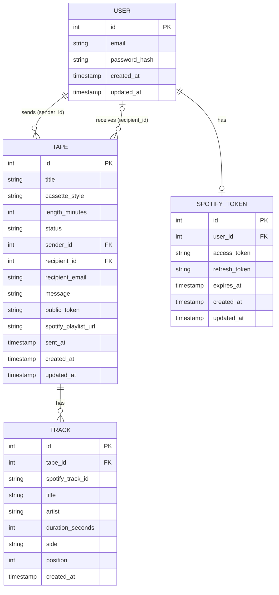

# Database diagram: Rewind

---

## Overview

5 tables. 4 of them connect to `User` directly or indirectly.

- `User`: the core. Every action in the app belongs to a user.
- `Tape`: the product. Created by a sender, optionally received by a recipient.
- `Track`: the songs. Each track belongs to a tape and is assigned to a side.
- `SpotifyToken`: the OAuth credentials for playlist export. One row per user, only set if they connect Spotify.

---

## Diagram



---

## Table notes

### User

Stores credentials only. No profile fields at this stage.

`updated_at` is here for when profile editing gets added later.

Passwords hashed with Argon2. The raw password never touches the database.

### Tape

The most complex table. A few things worth noting:

`sender_id` is always set. A tape always has an owner.

`recipient_id` is nullable. It starts as NULL when the tape is sent to an email address. It gets filled in when the recipient creates an account and claims the tape. See below.

`recipient_email` is permanent. It records where the tape was sent, regardless of whether the recipient ever creates an account.

`public_token` is a UUID generated at send time. It's the random slug used in the public URL: `/tape/{public_token}`. Never a sequential ID.

`status` follows this state machine:

```
draft → ready → sent → claimed
                  ↓
               archived
```
In the SQLAlchemy model, status is defined as a Python Enum, not a plain string. The diagram shows string for simplicity.

`cassette_style` stores which visual skin the sender picked (e.g. `classic`, `chrome`, `metal`). Stored as a string; the frontend maps it to CSS.

`length_minutes` is either 60 or 90. Side A and Side B each get exactly half.

`spotify_playlist_url` is nullable. Only set if the sender completes the optional Spotify export.

### Track

Each row is one song on one tape, assigned to one side.

`side` is either `A` or `B`.

`position` is the order of the track within its side. Starts at 1.

`duration_seconds` comes from Spotify. The service layer uses it to enforce the per-side time limit.

`spotify_track_id` is the Spotify identifier (e.g. `4uLU6hMCjMI75M1A2tKUQC`). Stored so the app can reconstruct the playlist or deep-link to Spotify if needed.

No `updated_at`. Tracks don't change once added. If a user removes a track, the row is deleted, not updated.

### SpotifyToken

One row per user. Only created when a user connects their Spotify account for playlist export.

`expires_at` is used by the service to check whether the access token needs refreshing before making a Spotify API call.

Tokens are stored server-side only. They are never sent to the frontend.

---

## Relationships

| Relationship | Type | Notes |
|---|---|---|
| User → Tape (sender) | one-to-many | A user can send many tapes |
| User → Tape (recipient) | one-to-many (nullable) | A user can receive many tapes; NULL until claimed |
| Tape → Track | one-to-many | A tape has many tracks across both sides |
| User → SpotifyToken | one-to-one (nullable) | Only exists if the user connected Spotify |

---

## How tape claiming works

1. Sender creates a tape and sends it to `maria@gmail.com`.
2. `Tape` row is created: `recipient_email = "maria@gmail.com"`, `recipient_id = NULL`.
3. Maria receives the email, clicks the link, views the tape as a guest.
4. Maria creates an account with `maria@gmail.com`.
5. On registration, the app queries for all tapes where `recipient_email` matches her email.
6. Those tapes get `recipient_id` set to her new user ID and `status` set to `claimed`.

This works for multiple tapes: if Maria received 3 tapes before creating an account, all 3 get claimed in one step.

Auto-claiming runs after email verification, not immediately on registration. A future alternative is explicit claiming: the recipient clicks a button on the tape page to claim it. The service layer function is the same either way; only the trigger changes.

---

## Migration strategy

These rules apply whenever the schema changes.

**Additive changes are safest.** Adding a new column, table, or optional field leaves existing rows unaffected.

**Never make a column required in a migration without backfilling it first.** The safe sequence is:
1. Add the column as nullable.
2. Run a backfill migration to populate existing rows with a sensible default.
3. Then make the column required.

**One change per migration.** Keep Alembic migrations small and focused. A migration that does 3 things is harder to roll back and harder to debug.

**Never edit a migration that has already run in production.** Always add a new migration. Editing a past migration breaks Alembic's version history.

**Validation rules live in code, not the database.** Password requirements, tape length limits, and similar constraints are enforced in the service layer. Changing them does not require a migration and does not affect existing rows.

**Test migrations on a copy of production data before running them live.** A migration that works on an empty database can fail on real data.
